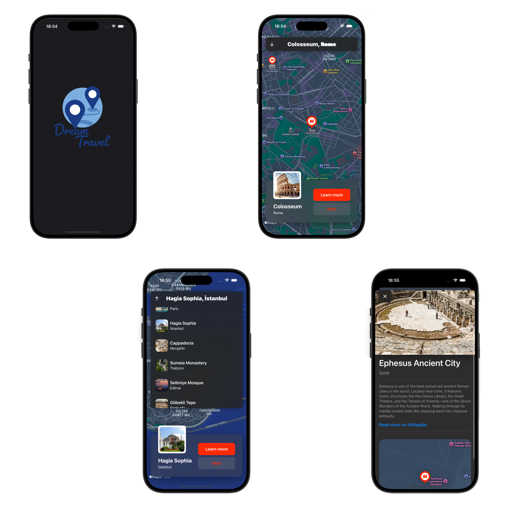

## 🖼️ Screenshots

# 🗺️ Dream Travel Map App

This is a beginner-level **Map app** developed using **SwiftUI** and **MapKit**, where you can view and interact with some of the gorgeous places around the world.  
It was created as a learning project to explore map integration, annotations, and SwiftUI basics.

## ✨ Features

- 🌍 Display a map using Apple’s **MapKit**
- 📍 Select pins to travel destinations
- 🌐 Click to Read more about locations on Wikipedia 
- 🧭 Zoom and navigate freely across the map
- 🎨 Clean and responsive SwiftUI interface
- 🌓 Light/Dark mode support

  
## 🔧 Technologies Used

- **SwiftUI**
- **MapKit**
- **MVVM (Lightweight structure)**

